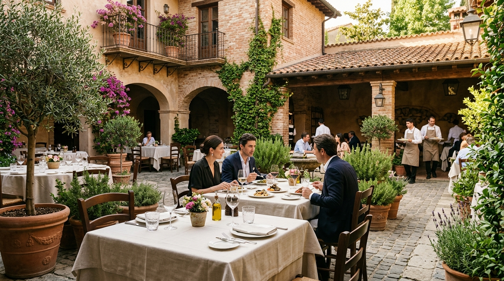

# Tuscany Courtyard — Kohsar Market, F-6/3, Islamabad
> Single-Page Ultra-Luxury Italian Fine-Dining Web Experience  
> Built with Semantic HTML5, Modern CSS3 (Vanilla), and Authentic Gastronomic Curation.



---

## 🏛️ Overview
**Tuscany Courtyard** is an upscale Italian fine-dining establishment located in Kohsar Market, Sector F-6/3, Islamabad. Known for its sunlit rustic courtyard, imported Mediterranean ingredients, and classical hospitality, this web project translates the dining experience into a digital medium.

---

## 🎨 Visual Identity & Design System
* **Background Palette:** Warm Alabaster (`#FAFAFA`) & Tuscan Linen (`#F5F3EF`)
* **Accent Color:** Muted Mediterranean Terracotta (`#E2725B`)
* **Typography:** 
  * Headings: `'Cinzel'` & `'Playfair Display'` (Editorial Serif)
  * Body: `'Inter'` (Clean Sans-Serif)
* **Contrast & Negative Space:** High-contrast Deep Charcoal (`#1A1A1A`) text with generous negative space and balanced grid alignments.

---

## 📋 Features & Authentic Menu Items

### The Lab Grid (Signature Selection)
1. **Margherita Pizza** — Italian sauce, cheese & fresh basil. Hand-stretched 48-hour fermented crust baked for a blistered cornicione. (`PKR 1,695`)
2. **Flame Grilled Jalapeno Burger** — Juicy flame-grilled patty topped with jalapeno cheese sauce on an artisanal brioche bun. (`PKR 1,645`)
3. **Tuscany Club Sandwich** — Grilled chicken, mortadella, layered with our special sauce and golden potatoes. (`PKR 1,645`)
4. **Fettuccine Alfredo Pasta** — Freshly prepared pasta with grilled chicken tossed in light creamy alfredo sauce and Parmigiano-Reggiano. (`PKR 1,975`)

---

## 🔬 Academic & Technical Demonstration

| Requirement | Implementation & Architectural Details |
| :--- | :--- |
| **Semantic HTML5** | Structured with `<header>`, `<nav>`, `<section id="hero">`, `<section id="menu">`, `<section id="heritage">`, `<section id="reservations">`, and `<footer>`. |
| **CSS Architecture** | Primary styling in external `style.css`, with intentional internal CSS in `<head>` for scoped status pills, and inline CSS on a decorative separator. |
| **Selector Mastery** | Comprehensive demonstration of Element, Class, ID, Attribute, Grouping, and Descendant selectors throughout. |
| **Display Values** | Explicit application of `display: block`, `display: inline`, `display: inline-block` (for navigation links and buttons), and `display: none` (for hidden decorative ribbons). |
| **Micro-Interactions** | Smooth `0.3s ease-in-out` transitions; `:hover` color shifts on nav items; tactile scale down (`transform: scale(0.98)`) on interactive buttons. |
| **Box Model & Layout** | Universal `box-sizing: border-box`, clear card margins, padding, borders, and ambient box shadows (`0 10px 30px rgba(0,0,0,0.05)`). |
| **Overflow Handling** | Card descriptions set to fixed height (`72px`) with `overflow-y: auto` and a custom-styled 4px minimalist WebKit scrollbar. |
| **First-Child Elevation** | Distinct elevated terracotta border and Chef's Signature badge on `:first-child` food card. |
| **Animated Heading Underline** | `::before` and `::after` pseudo-elements that seamlessly expand from center on section heading hover. |
| **Margin Collapsing** | Physically demonstrated in Heritage section between two consecutive paragraphs (`margin-bottom: 32px` + `margin-top: 24px` = `32px` collapsed). |
| **Specificity & Cascade** | Commented conflict demonstrations explaining why ID selectors override Class selectors, and how identical-specificity rules resolve via source order. |

---

## 🚀 Getting Started

Simply open `index.html` in any modern web browser or run with Live Server:
```bash
# Clone the repository
git clone https://github.com/muhammad121017/navarious-tuscany-courtyard.git

# Navigate into project folder
cd navarious-tuscany-courtyard

# Open index.html directly or with your favorite live server
```

---

## 📜 License
&copy; 2026 Tuscany Courtyard Islamabad. Built for academic lab demonstration.
